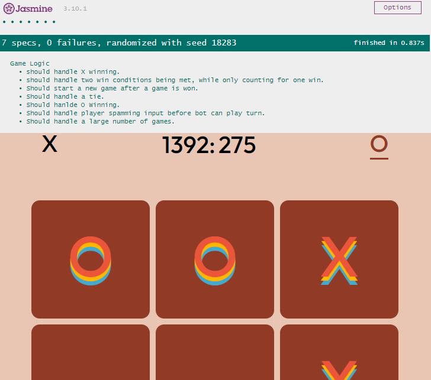

# tic-tac-toe-ts
[Live Demo](https://chet-gleave.github.io/tic-tac-toe-ts/)  

## Motivation
This project serves as a showcase of my ability to use TypeScript to maintain complex app state outside of a web framework.

## Technology Used
- TypeScript
- Sass
- Babel
- Karma
- Jasmine
- HTML5
- Node.js

## Testing
   
Unit tests written in Jasmine. To run tests:
```bash
npm install
npm test
```

## Code style 
BEM — Block Element Modifier

## Installation

Using [Node.js](https://nodejs.org/en/) install [TypeScript](https://www.typescriptlang.org/download) and [Sass](https://sass-lang.com/install)

```bash
npm install -g typescript
npm install -g sass
```
**To make changes to the TypeScript:**  
Using your command line, navigate to the tic-tac-toe-ts\js directory, and run

```bash
tsc --watch game_logic
# Any changes made in game_logic.ts will now be compiled to game_logic.js
```
  
- - -

**To make changes to the Sass:**  
Using your command line, navigate to the tic-tac-toe-ts\css directory, and run
```bash
sass --watch styles.scss styles.css
# Any changes made in styles.scss will now be compiled to styles.css
```

## Credits
The SVG used to create the strikethrough effect is the minus icon from Font Awesome. No modifications were made.
* [Minus Icon | Font Awesome](https://fontawesome.com/v5.15/icons/minus?style=solid)
* [License](https://fontawesome.com/license)

dependency/index.js is from [karma-babel-preprocessor](https://github.com/babel/karma-babel-preprocessor)
## License
[MIT](https://choosealicense.com/licenses/mit/)